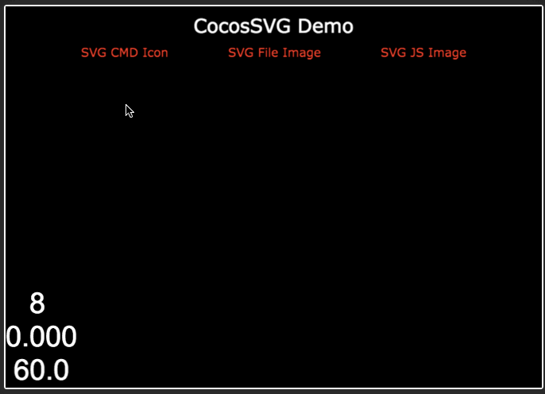

### CocosSVG

[A live demo is here.](http://supersuraccoon.github.io/CocosSVG)

A Cocos2d-JS v3.9 based SVG Path Parser with following features:

- Create `cc.Sprite` from `SVG` path command
- Create `cc.Sprite` from `SVG` file
- Support Filled Color
- Supported cmd
    -  (OK)        M       moveto                              (x y)+
    -  (OK)        Z       closepath                           (none)
    -  (OK)        L       lineto                              (x y)+
    -  (OK)        H       horizontal lineto                   x+
    -  (OK)        V       vertical lineto                     y+
    -  (OK)        C       curveto                             (x1 y1 x2 y2 x y)+
    -  (OK)        S       smooth curveto                      (x2 y2 x y)+
    -  (NO)        Q       Quadratic Bézier curveto            (x1 y1 x y)+
    -  (NO)        T       smooth quadratic Bézier curveto     (x y)+
    -  (NO)        A       elliptical arc                      (rx ry x-axis-rotation large-arc-flag sweep-flag x y)+
    -  (NO)        R       Catmull-Rom curveto*                x1 y1 (x y)+

Note:

Need to add some missing `Glue` functions to the `JSBinding` source code. Refer to the files in `framework/cocos2d-x/...` and search for `supersuraccoon`.

The project is `JSBinding` supported but there is still problems left in concave shape color filling with `Cocos2d-x`.